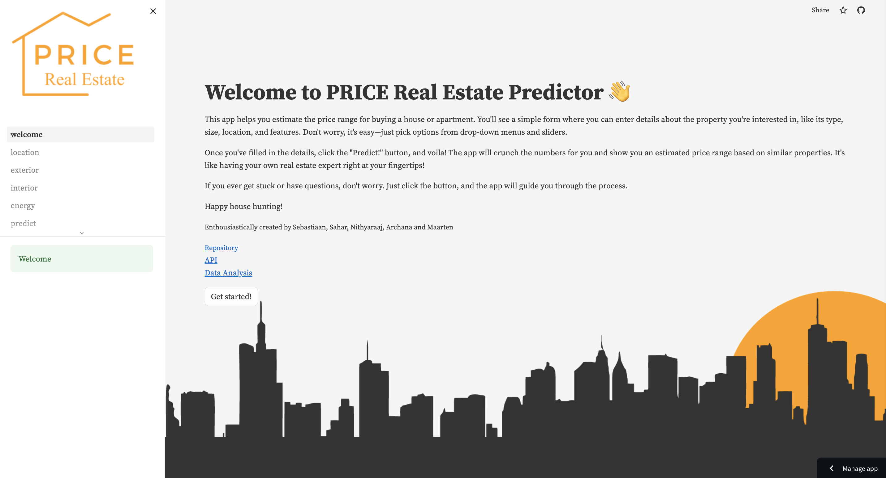

# 🏠 Real Estate Price Predictor

This Streamlit web application 🚀 is designed to predict the price range of real estate properties based on various features provided by the user. The application employs a machine learning model deployed as an API to make predictions. Users are guided through a series of steps to input property details, and the application then uses these inputs to predict the price range.

## Usage ⚙️

**Access the App:** Navigate to [ImmoEliza Predict](https://immoelizapredict.streamlit.app/) to access the application.

**Using the App:** Follow the instructions provided by the application to input property details at each step. Once all details are provided, click on the "Predict!" button to initiate the prediction process and view the predicted price range.

## Technical Details 🛠️

### Core Technologies 🚀

**Streamlit:** The application's user interface is built using Streamlit, a Python library that simplifies the creation of interactive web applications.

**Session State Management:** Streamlit's built-in session state management feature is utilized to persist data across different pages of the application.

**Custom Zipcodes Library:** A custom-made library is used to fetch location details such as latitude, longitude, region, and province based on the provided zip code.

### API 🤖

The machine learning model is exposed through a RESTful API with the following endpoint:

- **Endpoint:** `/predict`
- **Method:** POST
- **Request Body:** JSON format containing property details
- **Response:** Predicted price range in JSON format

Example Request:
```json
{
  "nbr_frontages": 2.0,
  "nbr_bedrooms": 3.0,
  "latitude": 50.8503,
  "longitude": 4.3517,
  "total_area_sqm": 150.0,
  "surface_land_sqm": 200.0,
  "terrace_sqm": 20.0,
  "garden_sqm": 50.0,
  "fl_terrace": 1,
  "fl_garden": 0,
  "fl_swimming_pool": 1,
  "province": "Brussels",
  "heating_type": "GAS",
  "state_building": "GOOD",
  "property_type": "APARTMENT",
  "epc": "C",
  "locality": "Brussels",
  "subproperty_type": "APARTMENT",
  "region": "Brussels-Capital"
}

Example Response:  
```json  
{
  "price_range": {
    "lower_bound": 250000.0,
    "upper_bound": 280000.0
  }
}
## Application Structure

### Location Input (location.py) 🗺️

- Collects location details such as zip code and locality from the user.
- Loads unique property data from JSON files to populate dropdown menus and sliders.
- Coordinates can optionally be set using the provided map.

### Exterior Features Input (exterior.py) 🏡

- Gathers exterior features including living space area, terrace, garden, etc., from the user.
- Handles boolean features such as terrace, garden, and swimming pool by calculating integer values.

### Interior Features Input (interior.py) 🛋️

- Captures interior features like the number of bedrooms, kitchen equipment, building condition, etc., from the user.

### Energy Features Input (energy.py) ⚡

- Acquires energy-related features such as EPC class and heating type from the user.

### Prediction (predict.py) 🚀

- Collects all input features from previous steps and prepares them for prediction.
- Utilizes the custom zipcodes library to fetch location details.
- Sends input data to the prediction API endpoint via HTTP POST request and displays the predicted price range upon receiving the response.

### Authors

[Maarten Knaepen](https://github.com/MaartenKnaepen) 🧑‍💻
[Sahar Mahmoudi](https://github.com/sahar-mahmoudi) 🧑‍💻
